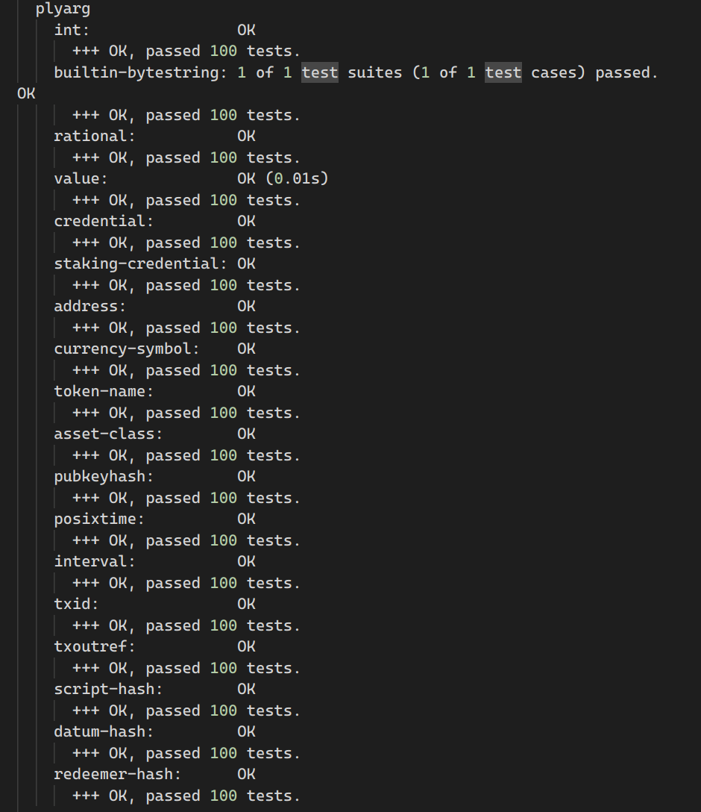

Evidence of completion:

1. Code implementing Plutus V3 types support: [ply-core](./ply-core/src/Ply/Core/Class.hs), [ply-plutarch](./ply-plutarch/src/Ply/Plutarch/Class.hs). Documentation is attached to haddock on aforementioned projects.

2. Updated code for encoding into CIP-57: [ply-core](./ply-core/src/Ply/Core/Schema/Description.hs), [ply-plutarch](./ply-plutarch/src/Ply/Plutarch/TypedWriter.hs), [example](./example/compiler-app/Main.hs).

    Screenshots:
    - 
    - 
    - 

3. Example in documentation showcasing argument application: [example](./example/reader-app/Main.hs)
4. Test suites: [ply-core](./ply-core/test/), [ply-plutarch](./ply-plutarch/test/)
    Screenshots:
    - 
    - 
    - 
5. Schema derivation for user defined type(s): [example](./example/common/Example/Type.hs)
6. New user guide: [README](./README.md)
7. Final closeout report: TODO.
8. Final closeout video: TODO.