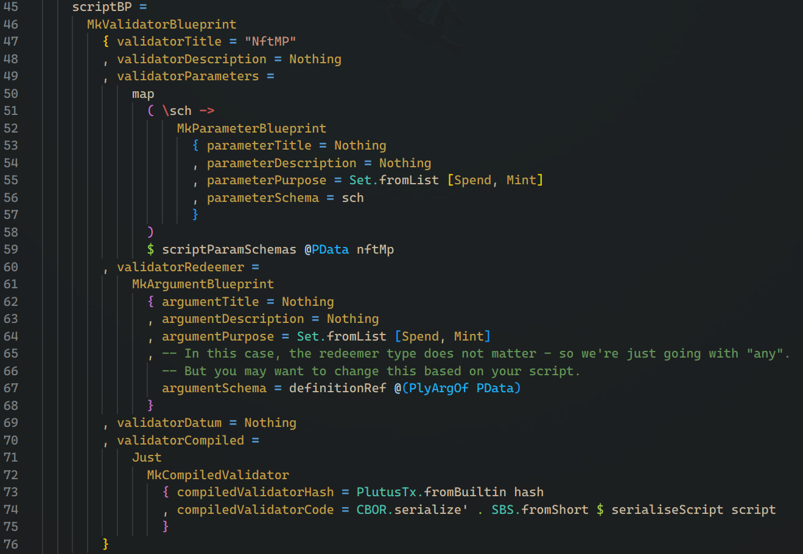
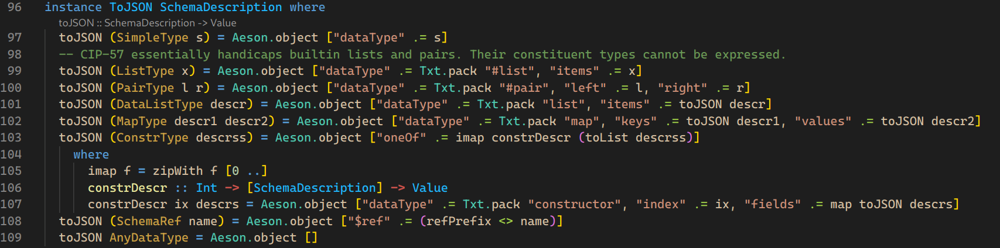
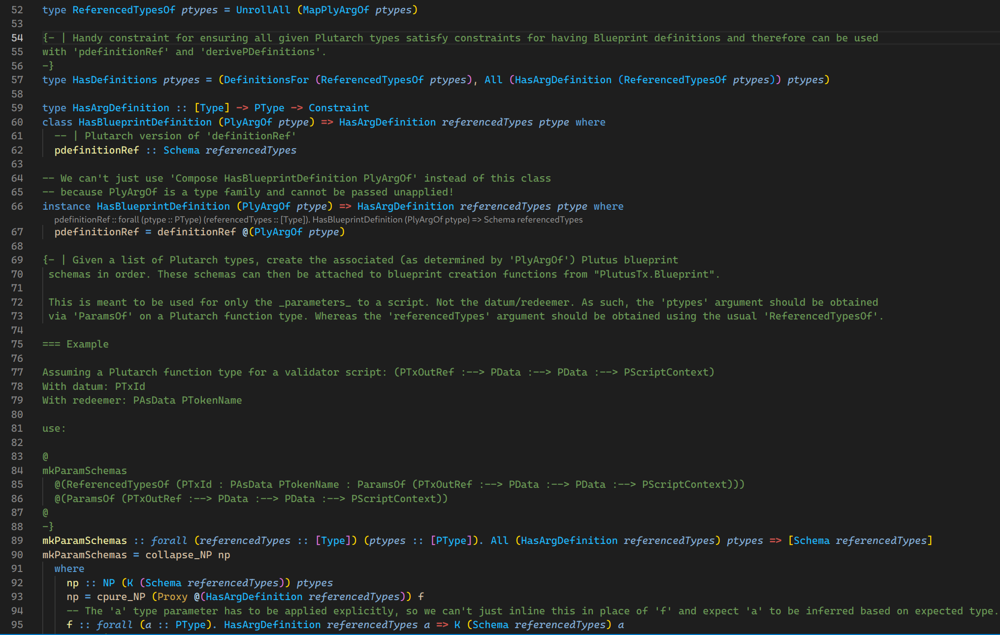
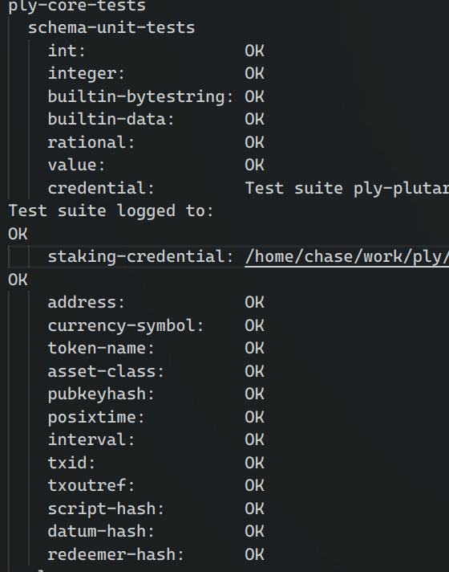
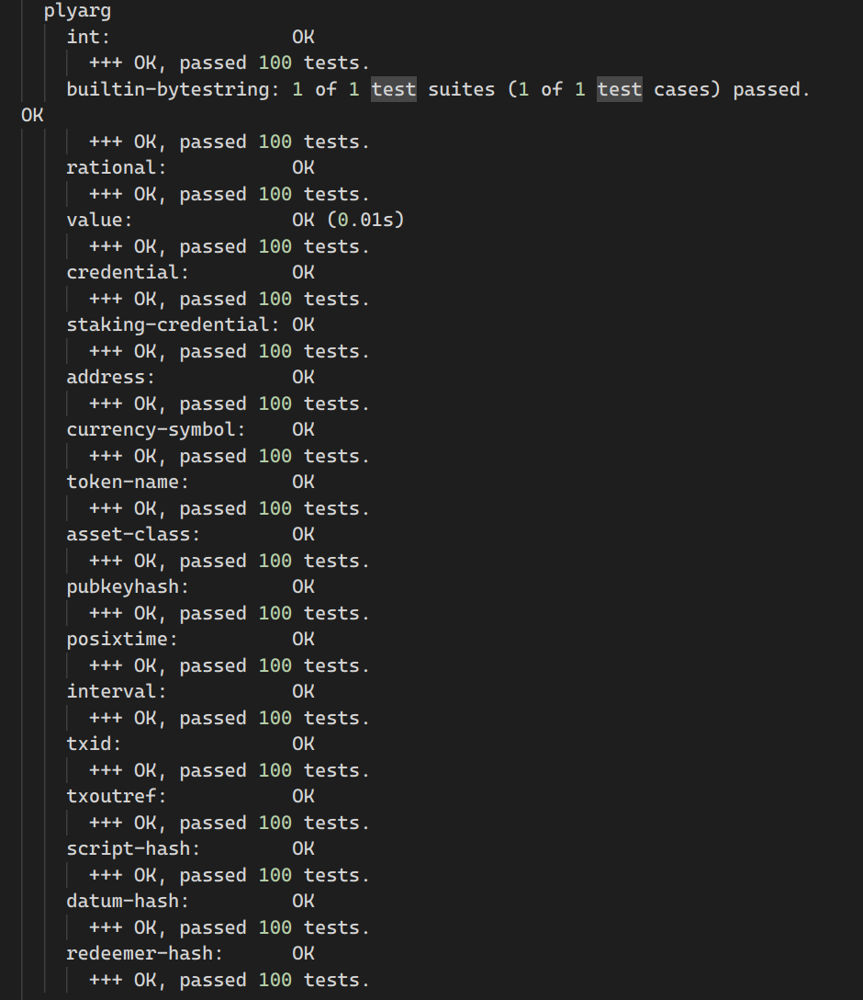
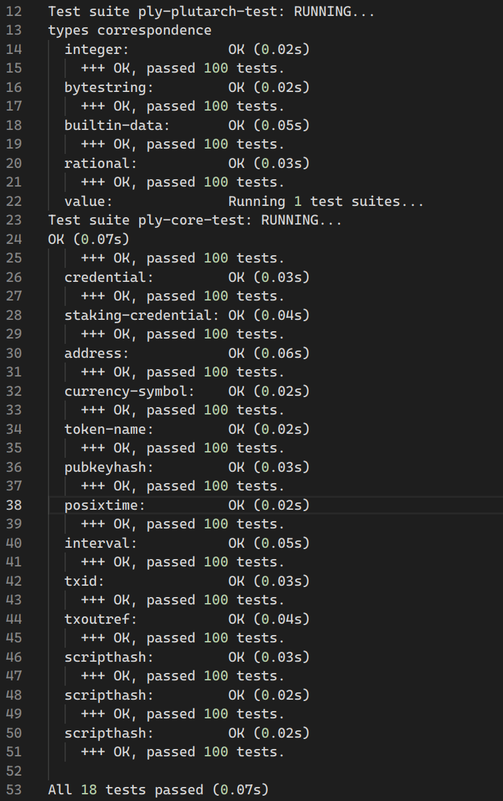

# Catalyst F13 report - MLabs: Tooling upgrade for Conway compatibility

## Milestone 5 - Implementing CIP 57 Compatibility, Encoding/Decoding, and Schema Derivation in ply a helper library for working with compiled Plutus scripts

Catalyst URL:
[https://milestones.projectcatalyst.io/projects/1300144/milestones/5](https://milestones.projectcatalyst.io/projects/1300144/milestones/5)

## Evidence of milestone completion

1. Link to the updated code adding support for PlutusV3 types and a link is provided. Documentation and code for the new features are available in the repository at [Ply Github](https://github.com/mlabs-haskell/ply)

   - tagged version of Ply supporting V3 types. [mlabs-haskell/ply/tree/v1.0.0](https://github.com/mlabs-haskell/ply/tree/v1.0.0)
   - PlutusV3 type support on the Plutarch side: https://github.com/mlabs-haskell/ply/blob/v1.0.0/ply-plutarch/src/Ply/Plutarch/Class.hs
   - PlutusV3 type support on Plutus side is automatic via `PlutusTx.Blueprint.schema`: https://github.com/mlabs-haskell/ply/blob/803b2dd0764ddb96ca55dc28056e3a6006cf8a90/ply-core/src/Ply/Core/Internal/Reify.hs#L31C22-L31C28

2. Link to updated code for encoding typed scripts into CIP 57-conforming JSON and a link and screenshot is provided.

   - Code for Schema encoding/decoding: [ply-core](https://github.com/mlabs-haskell/ply/blob/v1.0.0/ply-core/src/Ply/Core/Schema/Description.hs)
   - Code for Plutarch side type conversion: [ply-plutarch](https://github.com/mlabs-haskell/ply/blob/v1.0.0/ply-plutarch/src/Ply/Plutarch/TypedWriter.hs)
   - Purescript code for parsing: [ply-ctl](https://github.com/mlabs-haskell/ply-ctl/blob/f900bd047f0d724bb3a107f0b1b02824ed8187d5/src/Ply/Schema.purs#L77) (available at [this PR](https://github.com/mlabs-haskell/ply-ctl/pull/4))
   Screenshots:
       - 
       - 
       - 

3. Link to an example in the documentation showcasing that argument application can use Ply types and schemas.

    - [example](https://github.com/mlabs-haskell/ply/blob/v1.0.0/example/reader-app/Main.hs)

4. Link to test suite results show all tests passing, including round-trip tests, unit tests, and property tests and several screenshots indicating this

   - Test suites: [ply-core](https://github.com/mlabs-haskell/ply/blob/v1.0.0/ply-core/test/), [ply-plutarch](https://github.com/mlabs-haskell/ply/blob/v1.0.0/ply-plutarch/test/)
    Screenshots:
    - 
    - 
    - 
5. Links to examples of successful schema derivation for user-defined types are demonstrated: [example](https://github.com/mlabs-haskell/ply/blob/v1.0.0/example/common/Example/Type.hs)
6. Link to new user guide documentation: [README](https://github.com/mlabs-haskell/ply/blob/v1.0.0/README.md)

